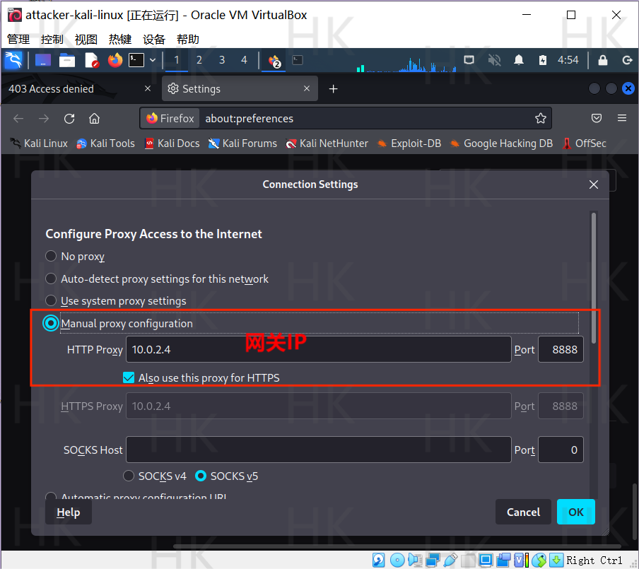
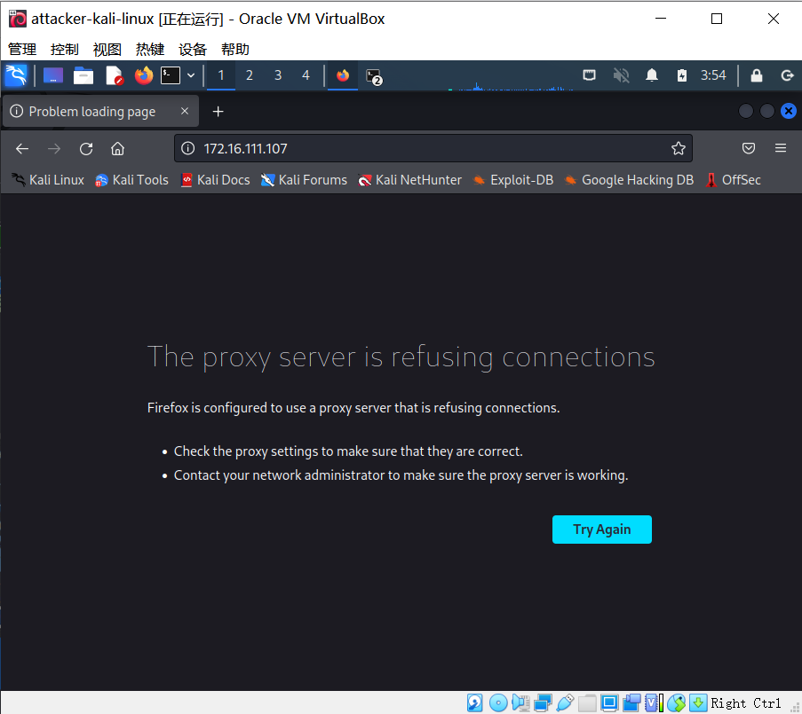

# HTTP代理服务器实验

## 实验目的

验证：在`Kali Linux`中安装`tinyproxy`，在主机设置浏览器代理指向`tinyproxy`建立的`HTTP`正向代理，在`Kali`中用`Wireshark` 抓包，分析抓包过程，理解`HTTP`正向代理`HTTPS`流量的特点。

## 实验环境


如图所示网络中的节点基本信息如下：

+ 网关

  + Gateway-Debian-1

  + 08:00:27:0b:6d:2c / en0s9
  + 10.0.2.4 | 172.16.111.1

+ 攻击者主机

  + attackter-kali-linux

  + 08:00:27:e9:59:4f / eth2    
  + 10.0.2.15 | 172.16.111.142

+ 受害者主机

  + Victim-Kali-1

  + 08:00:27:d4:7e:b8 / eth0   
  + 172.16.111.107


## 实验过程

### 根据网络拓扑测试网络连通性

+ **Gateway配置tinyproxy**

  ```
  # 安装tinyproxy
  apt update 
  apt install tinyproxy
  
  # 编辑tinyproxy配置文件，取消Allow 10.0.0.0/8行首注释
  vim /etc/tinyproxy/tinyproxy.conf
  
  # 开启tinyproxy服务
  systemctl start tinyproxy
  ```

  + 修改配置文件

    

+ **攻击者主机配置代理**

  + 首先打开`attackter-kali-linux`的Firefox，按照`Open Application Menu->Settings->Network Settings->Settings`的顺序进入代理配置，然后将`Configure Proxy Access to the Internet`选项选为`Manual proxy configuration`进行手动配置

    

    

    

+ **使用代理服务器访问靶机**

  + 在攻击者主机配置好代理服务器后分别在攻击者主机、靶机上开启`wireshark`进行抓包

  + 在攻击者主机的Firefox浏览器上访问靶机地址`172.16.111.107`

    **攻击者主机：**

    + 当靶机开启`Apache2`服务时，攻击者主机访问靶机IP地址`172.16.111.107`后，网页显示`Apache2`默认页面，攻击者主机访问`172.16.111.107/hack`后显示`404 not found`，并没有显示代理服务器的信息。

      

      

      分析流量发现HTTP响应中包含`via`字段，说明此时攻击者主机想要访问靶机需要经过`tinyproxy`，此时网关提供代理服务。

      

    **靶机：**

    + 对靶机抓包得到的流量进行分析，同样也在`HTTP`响应中发现了`via`字段，说明此时网关提供了代理服务，此时攻击者主机的`IP`等信息都没有暴露。

      

## 实验遇到的问题

+ 在为Gateway配置`tinyproxy`使用`apt-get`命令会出现报错

  ```
  E: Failed to fetch http://mirrors.ustc.edu.cn/debian/pool/main/t/tinyproxy/tinyproxy_1.10.0-2_all.deb  404  Not Found [IP: 202.141.160.110 80]
  ```

  出现这种错误的原因是`dns`服务器地址没有设置正确，打开`/etc/resolv.conf`文件，将内容修改成：

  ```
  nameserver 114.114.114.114
  nameserver 8.8.8.8
  ```

  保存退出重启即可

+ 在攻击者访问靶机时浏览器出现了报错

  

  但是在靶机访问攻击者主机就可以，在参考了同学的实验报告时终于发现了一致的问题！本次实验是在第五次实验的环境下做的，攻击者主机的网络配置是内部网络，需要修改为`NAT`！并且要把靶机的防火墙关闭，`apache2`服务开启。

## 参考资料

+ [在线教材](https://c4pr1c3.github.io/cuc-ns/chap0x03/exp.html)
+ [CUCCS/ 2022-ns-public-chen-xueting](https://github.com/CUCCS/2022-ns-public-chen-xueting)
