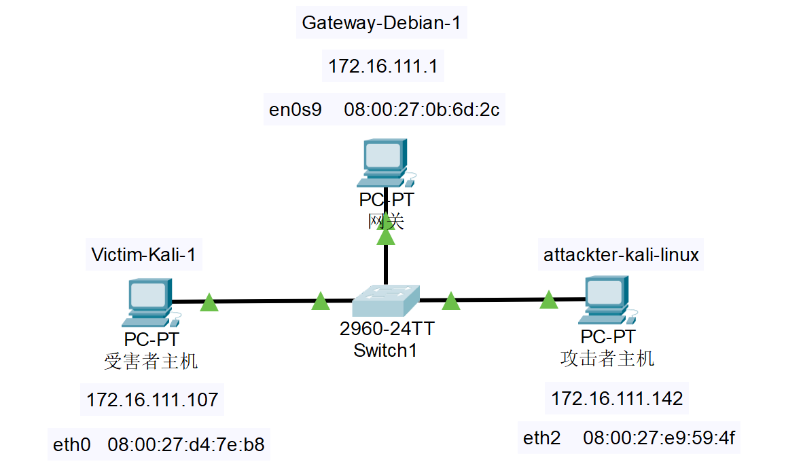
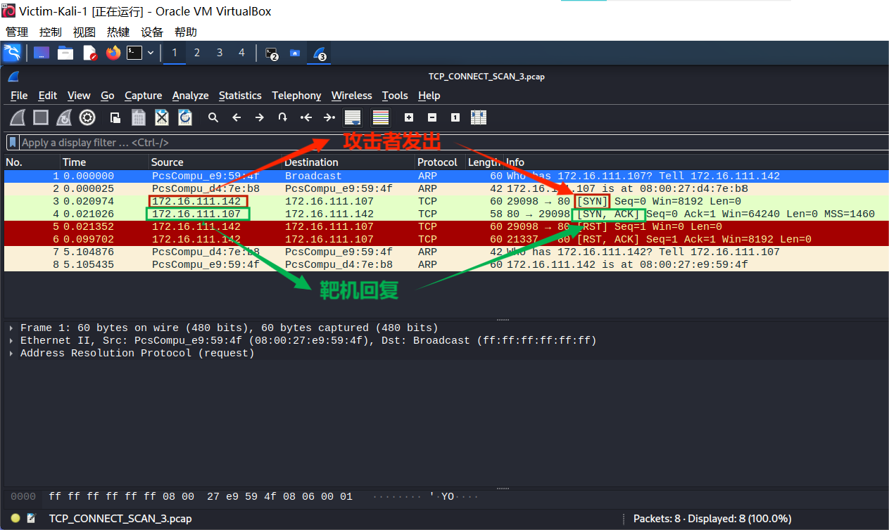
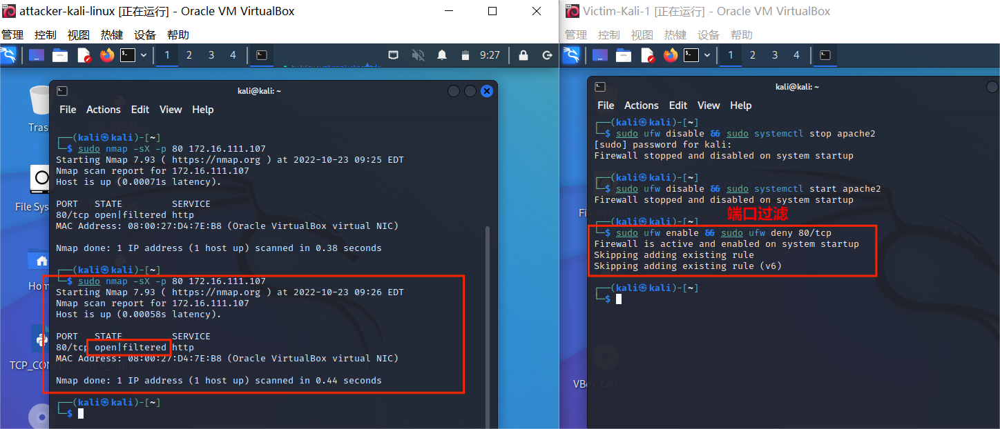

# 基于 Scapy 编写端口扫描器

## 实验目的

- 掌握网络扫描之端口状态探测的基本原理

## 实验环境

- python + scapy

## 实验要求

- [x] 禁止探测互联网上的 IP ，严格遵守网络安全相关法律法规

- [x] 完成以下扫描技术编程实现
  + [x] TCP connect scan / TCP stealth scan
  + [x] TCP Xmas scan / TCP fin scan / TCP null scan
  + [x] UDP scan

- [x] 上述每种扫描技术的实现测试均需要测试端口状态为：`开放`、`关闭` 和 `过滤` 状态时的程序执行结果

- [x] 提供每一次扫描测试的抓包结果并分析与课本中的扫描方法原理是否相符？如果不同，试分析原因；
- [x] 在实验报告中详细说明实验网络环境拓扑、被测试 IP 的端口状态是如何模拟的
- [x] （可选）复刻 `nmap` 的上述扫描技术实现的命令行参数开关

## 实验过程

### 网络环境拓扑图

+ 为了实现扫描过程模拟，使用虚拟机建立如下网络拓扑




### 端口状态模拟

+ 查看当前防火墙的状态和现有规则

  ```bash
  ufw statusV
  ```

+ 端口关闭状态：对应端口未开启监听，防火墙处于关闭状态

  ```bash
  ufw disable
  ```

+ 端口开启状态：对应端口开启监听，防火墙处于关闭状态

  - `Apache2`基于`TCP`，在**80端口**提供服务

  - `Dnsmasq`基于`UDP`，在**53端口**提供服务

    ```bash
    # 80端口
    ufw disable && systemctl start apache2
    # 53端口
    ufw disable && systemctl start dnsmasq
    ```

+ 端口过滤状态：对应端口开启监听，防火墙开启

  ```bash
  ufw enable && ufw deny 80/tcp
  ufw enable && ufw deny 53/udp
  ```

+ 开启端口

  ```
  systemctl start apache2 # port 80
  systemctl start dnsmasq # port 53
  ```

+ 关闭端口

  ```
  systemctl stop apache2 # port 80
  systemctl stop dnsmasq # port 53
  ```

  

### 三种扫描技术的编程实现

#### TCP connect scan （TCP全连接扫描）

+ 利用TCP协议，直接连到目标端口并完成完整的3次握手过程（SYN、SYN/ACK、ACK）。操作系统提供`connect()`函数完成系统调用，用来与目标计算机的端口进行连接。如果端口处于侦听状态，那么`connect()`函数就能成功，否则端口不可用，即没有提供服务。

+ 响应分类

  | 目标主机状态          | 端口状态      |
  | --------------------- | ------------- |
  | 接收 `SYN/ACK` 数据包 | 开放          |
  | 接收 `RST/ACK` 数据包 | 关闭&链接重置 |
  | 无响应                | 过滤状态      |

  > 若接收到 `SYN/ACK` 数据包（即检测到端口是开启的），便发送一个 `ACK` 确认包到目标主机，这样便完成了三次握手连接机制。成功后再终止连接。

+ 在攻击者主机(attacker-kali-linux)编辑 `python` 代码

  ```python
  from scapy.all import *
  
  src_port = RandShort()
  dst_ip = "172.16.111.107"
  src_ip= "172.16.111.142"
  dst_port = 80
  
  resp = sr1(IP(src=src_ip,dst=dst_ip)/TCP(sport=src_port,dport=dst_port,flags="S"),timeout=10)
  
  
  if resp is None:
      print("Filtered")
  
  elif (resp.haslayer(TCP)):
      if (resp.getlayer(TCP).flags == 0x14):   
          print ("Closed")
      elif(resp.getlayer(TCP).flags == 0x12): 
          send_rst = sr(IP(dst=dst_ip)/TCP(sport=src_port,dport=dst_port,flags="AR"),timeout=10)
          print ("Open")
  ```


**端口关闭**

```bash
# 靶机
sudo ufw disable
```

+ 在attacker中运行编好的代码，同时在victim主机上进行抓包

  ```bash
  # attacker
  sudo python3 TCP_CONNECT_SCAN.PY
  
  # victim
  ## -i 指定要过滤的网卡接口
  ## 使用 -w 参数后接一个以 .pcap 后缀命令的文件名，就可以将 tcpdump 抓到的数据保存到文件中
  sudo tcpdump -i eth0 -w TCP_CONNECT_SCAN.pcap
  ```

  

  

  > 从抓包结果可以看到，攻击者主机发送 `SYN` 数据包到靶机，靶机回复 `RST/ACK`数据包，端口关闭，与理论相符。

+ `nmap` 复刻

  ```bash
  # 攻击者主机
  nmap -sT -p 80 172.16.111.107
  ```

  

  

  > 结果一致

**端口开启**

```bash
# 靶机
## 防火墙关闭，对应端口开启监听
sudo ufw disable && sudo systemctl start apache2
```

+ 攻击者主机运行代码，靶机抓包，操作同上

  

  
  
  >从抓包结果可以看到，攻击者主机发送 `SYN` 数据包到靶机，靶机回复 `SYN/ACK`数据包，端口开放，与理论相符。
  
+ `nmap` 复刻

  ```bash
  # 攻击者主机
  nmap -sT -p 80 172.16.111.107
  ```

  

  

  > 结果一致

**端口过滤**

```bash
# 靶机
## 防火墙开启，对应端口开启监听
sudo ufw enable && sudo ufw deny 80/tcp
```

+ 操作同上

  

  

  > 攻击者发出数据包，靶机无响应，端口处于过滤状态，与理论相符。

+ `nmap` 复刻

  ```bash
  # 攻击者主机
  nmap -Pn -sT -p 80 172.16.111.107
  ```

  

  

  >结果一致

#### TCP stealth scan

+ 先发送一个`SYN`，然后等待回应。如果接收到 `RST/ACK` 包，说明目标端口处于关闭状态；如果接收到`SYN/ACK`，说明目标端口处于开放状态。这时`TCP stealth scan`只回复一个`RST`，不完成三次握手，直接取消建立连接；端口过滤状态无响应。

+ 在攻击者主机(attacker-kali-linux)编辑 `python` 代码

  ```python
  from scapy.all import *
  
  src_port = RandShort()
  dst_ip = "172.16.111.107" 
  dst_port = 80
  
  stl_resp = sr1(IP(dst=dst_ip)/TCP(sport=src_port,dport=dst_port,flags="S"),timeout=10)
  
  if stl_resp is None:
      print ("Filtered")
  
  elif(stl_resp.haslayer(TCP)):
      if (stl_resp.getlayer(TCP).flags == 0x14):
          print ("Closed")
      elif(stl_resp.getlayer(TCP).flags == 0x12):
          send_rst = sr(IP(dst=dst_ip)/TCP(sport=src_port,dport=dst_port,flags="R"),timeout=10)
          print ("Open")
  ```

**端口关闭**

```bash
# 靶机
## 关闭防火墙，关闭监听
sudo ufw disable && sudo systemctl stop apache2
```

+ 攻击者主机运行代码，靶机进行抓包

  ```bash
  # 攻击者主机
  sudo python3 TCP_STEALTH_SCAN.PY
  # 靶机
  sudo tcpdump -i eth0 -w TCP_STEALTH_SCAN.pcap
  ```

  

  

  >攻击者主机发出`SYN`包，靶机响应并回复`RST/ACK`包，端口关闭，与理论相符。

+ `nmap` 复刻

  ```bash
  sudo nmap -sS -p 80 172.16.111.107
  ```

  

  > 结果一致

**端口开放**

```bash
sudo ufw disable && sudo systemctl start apache2
```

+ 操作同上

  

  

  >攻击者主机发出`SYN`包，靶机响应并回复`SYN/ACK`包，这时`TCP stealth scan` 只回复一个`RST`，不完成三次握手，直接取消建立连接端口开放，与理论相符。

+ `nmap` 复刻

  

  > 结果一致

**端口过滤**

```bash
sudo ufw enable && sudo ufw deny 80/tcp
```

+ 操作同上

  

  

  > 攻击者主机发送 `SYN` 包，靶机无响应，说明端口处于过滤状态，与理论相符。

+ `nmap` 复刻

  

  > 结果一致


#### TCP Xmas scan

+ Xmas发送一个`TCP`包，并对TCP报文头`FIN、URG和PSH`标记进行设置。端口关闭则回复`RST`报文；开放和过滤状态下端口无响应。

+ 代码

  ```python
  from scapy.all import *
  
  dst_ip = "172.16.111.107"
  dst_port = 80
  
  resp = sr1(IP(dst=dst_ip)/TCP(dport=dst_port,flags="FPU"),timeout=10)
  
  if resp is None:
      print ("Open|Filtered")
  
  elif(resp.haslayer(TCP)):
      if(resp.getlayer(TCP).flags == 0x14):
          print ("Closed")
  ```

**端口关闭**

+ 攻击者主机运行代码，靶机进行抓包

  

  

  > 攻击者发送 `TCP` 包并对报文头进行`FIN、URG和PSH`标记，靶机回复`RST` ，端口关闭，与理论相符。

+ nmap

  ```bash
  sudo nmap -sX -p 80 172.16.111.107
  ```
  
  

**端口开放**

+ 操作同上

  

  

  > 攻击者发送 `TCP` 包并对报文头进行`FIN、URG和PSH`标记，靶机无响应，端口开放，与理论相符。

+ nmap

  ```bash
  sudo nmap -sX -p 80 172.16.111.107
  ```
  
  
  
  

**端口过滤**

+ 操作同上

  

  

  > 攻击者发送 `TCP` 包并对报文头进行`FIN、URG和PSH`标记，靶机无响应，端口过滤，与理论相符。

+ nmap

  ```bash
  sudo nmap -sX -p 80 172.16.111.107
  ```
  
  

#### TCP FIN scan

+ 仅发送`FIN`包，收到`RST`包说明端口处于关闭状态；开启/过滤状态时无响应。

+ 代码

  ```python
  from scapy.all import *
  
  dst_ip = "172.16.111.107" 
  dst_port = 80
  
  resp = sr1(IP(dst=dst_ip)/TCP(dport=dst_port,flags="F"),timeout=10)
  
  if resp is None:
      print ("Open|Filtered")
  
  elif(resp.haslayer(TCP)):
      if(resp.getlayer(TCP).flags == 0x14):
          print ("Closed")
  ```

**端口关闭**

+ 攻击者主机运行代码，靶机抓包

  

  

  > 攻击者发送`FIN`包，靶机回复`RST`，端口关闭，与理论相符。

+ nmap

  ```bash
  sudo nmap -sF -p 80 172.16.111.107
  ```

  

**端口开放**

+ 操作同上

  

  

  > 攻击者发送`FIN`包，靶机无响应，端口开放，与理论相符。

+ nmap

  ```bash
  sudo nmap -sF -p 80 172.16.111.107
  ```

  

**端口过滤**

+ 操作同上

  

  

  > 攻击者发送`FIN`包，靶机无响应，端口过滤，与理论相符。

+ nmap

  ```bash
  sudo nmap -sF -p 80 172.16.111.107
  ```

  

#### TCP NULL scan

+ 发送的`TCP`中关闭所有`TCP`报⽂头标记，如果收到`RST`包说明端口为关闭状态；开启/过滤状态无响应。

+ 代码

  ```python
  from scapy.all import *
  
  dst_ip = "172.16.111.107" 
  dst_port = 80
  
  resp = sr1(IP(dst=dst_ip)/TCP(dport=dst_port,flags=""),timeout=10)
  
  
  if resp is None:
      print ("Open|Filtered")
  
  elif(resp.haslayer(TCP)):
      if(resp.getlayer(TCP).flags == 0x14):
          print ("Closed")
  ```

**端口关闭**

+ 攻击者主机运行代码，靶机抓包

  

  

  > 攻击者发送`TCP` 包，靶机回复`RST`，端口关闭，与理论相符。

+ nmap

  ```bash
  sudo nmap -sN -p 80 172.16.111.107
  ```

  

**端口开放**

+ 操作同上

  

  

+ nmap

  ```bash
  sudo nmap -sN -p 80 172.16.111.107
  ```

  

**端口过滤**

+ 操作同上

  

  

+ nmap

  ```bash
  sudo nmap -sN -p 80 172.16.111.107
  ```

  

#### UDP scan

+ 发送`UDP`包进行扫描。当收到`UDP`回复时，该端口为开启状态；关闭/过滤状态无响应。

+ 代码

  ```python
  from scapy.all import *
  
  dst_ip = "172.16.111.107"
  src_port = RandShort()
  dst_port= 53
  dst_timeout=10
  
  def udp_scan(dst_ip,dst_port,dst_timeout):
      udp_scan_resp = sr1(IP(dst=dst_ip)/UDP(dport=dst_port),timeout=dst_timeout)
      if udp_scan_resp is None: #no response
          print("opened|flitered")
      elif (udp_scan_resp.haslayer(UDP)): # response  open
          print("open")
      elif(udp_scan_resp.haslayer(ICMP)): # response icmp
          if(int(udp_scan_resp.getlayer(ICMP).type)==3 and int(udp_scan_resp.getlayer(ICMP).code)==3):#desination unreachable
              print("closed")
          elif(int(udp_scan_resp.getlayer(ICMP).type)==3 and int(udp_scan_resp.getlayer(ICMP).code) in [1,2,9,10,13]):#filter
              print("closed")
      else:
          print(str(type(udp_scan_resp)))
  
  
  udp_scan(dst_ip,dst_port,dst_timeout)
  ```

**端口关闭**

+ 攻击者主机运行代码，靶机抓包

  ```bash
  sudo ufw disable && sudo systemctl stop dnsmasq
  ```

  

  

+ nmap

  ```bash
  sudo nmap -sU -p 53 172.16.111.107
  ```

  

**端口开放**

+ 攻击者主机运行代码，靶机抓包

  ```bash
  sudo ufw disable && sudo systemctl start dnsmasq
  ```

  

  

+ nmap

  ```bash
  sudo nmap -sU -p 53 172.16.111.107
  ```

  

**端口过滤**

+ 攻击者主机运行代码，靶机抓包

  ```bash
  sudo ufw enable && sudo ufw deny 53/udp
  ```

  

  

+ nmap

  ```bash
  sudo nmap -sU -p 53 172.16.111.107
  ```

  


## 实验小结

+ `kali`中的 `.py` 文件区分大小写

  

+ `tcp connect scan` 端口过滤状态使用 `nmap` 复刻时出现

  ```bash
  Note: Host seems down. If it is really up, but blocking our ping probes, try -Pn
  ```

  

  + 解决办法：

    > note中指出，目标主机阻塞了ping探针，所以使用 `-Pn` 进行**无ping扫描**即可

    ```bash
    nmap -Pn -sT -p 80 172.16.111.107
    ```

    
  
+ 靶机无法安装 `dnsmasp`

  ```bash
  sudo apt update && sudo apt install dnsmasq
  ```

  使用上述命令安装后下面会出现 `error` 提示，根据提示在上述命令后追加 `--fix-missing` 就可以安装成功。

  最终运行代码：

  ```bash
  sudo apt update && sudo apt install dnsmasq --fix-missing
  ```

  


## 参考资料

+ [在线课本](https://c4pr1c3.github.io/cuc-ns/chap0x05/main.html)

+ [Nmap的常用命令和高级用法](https://www.cnblogs.com/Alwayslearn/p/16517285.html)

+ [Nmap学习3 - 主机发现](https://blog.csdn.net/weixin_43838889/article/details/122550657)

  